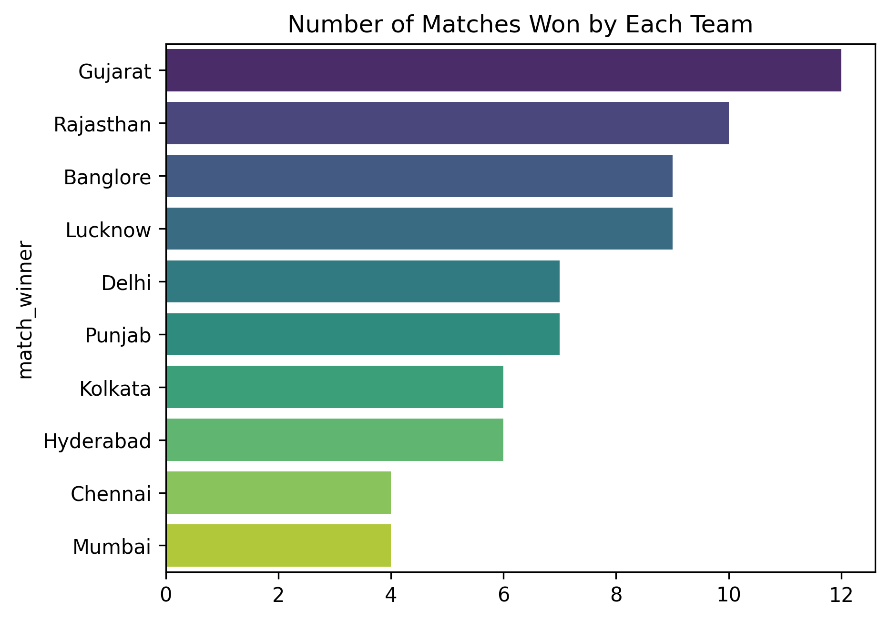
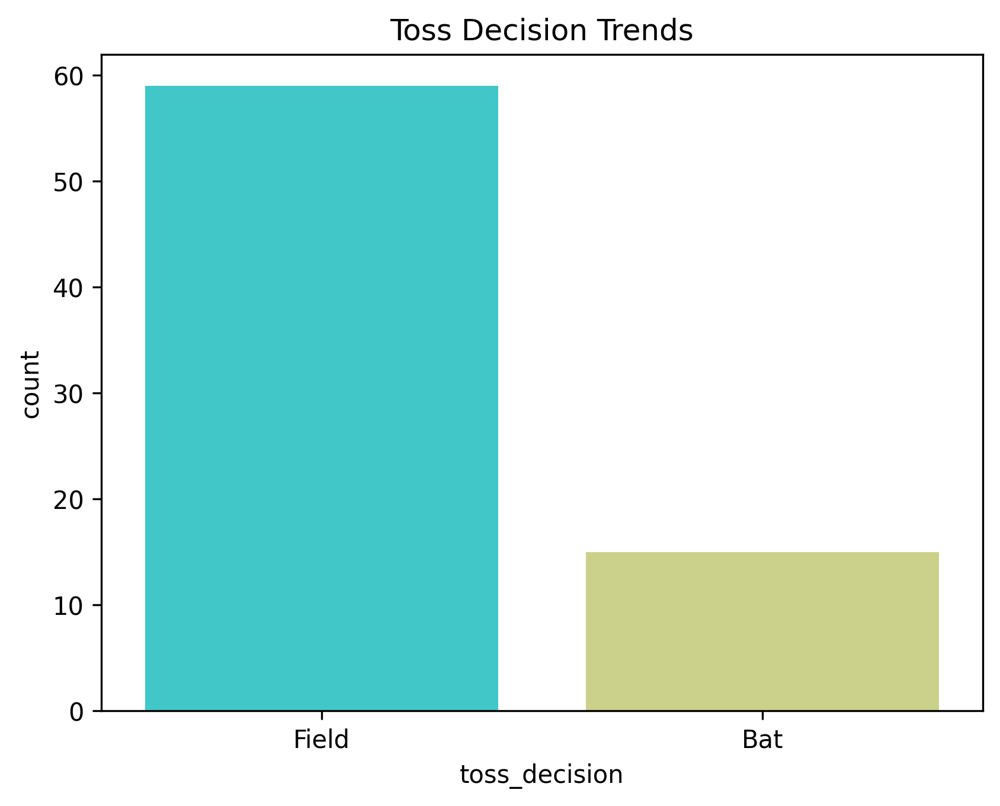
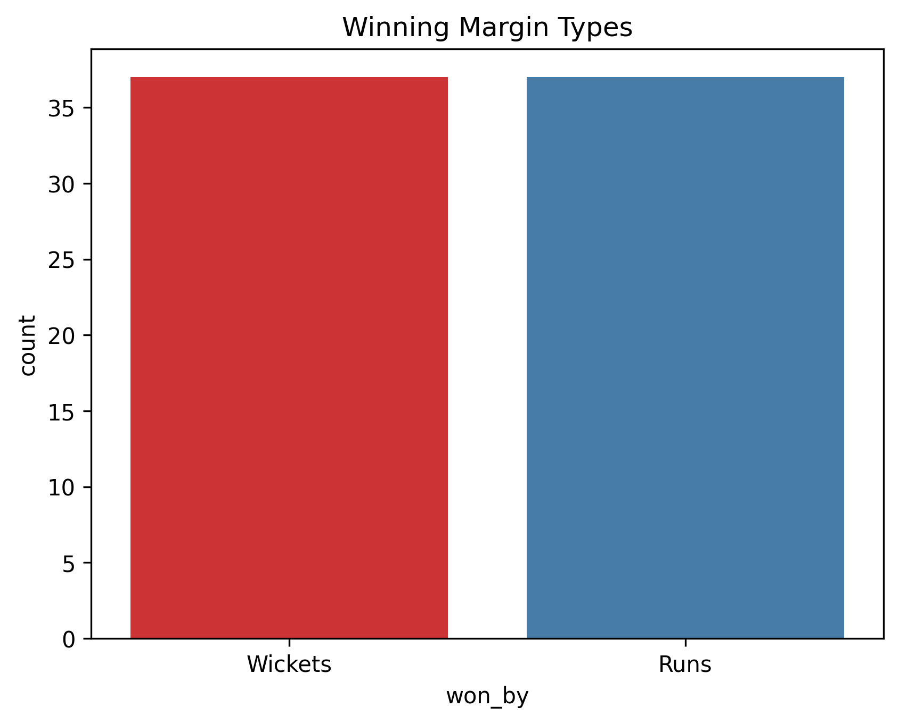
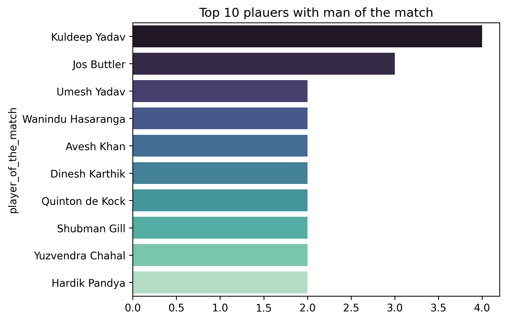
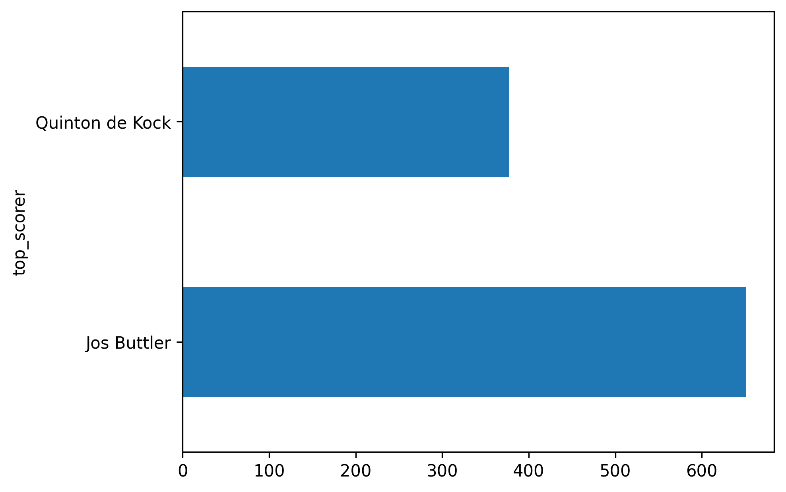
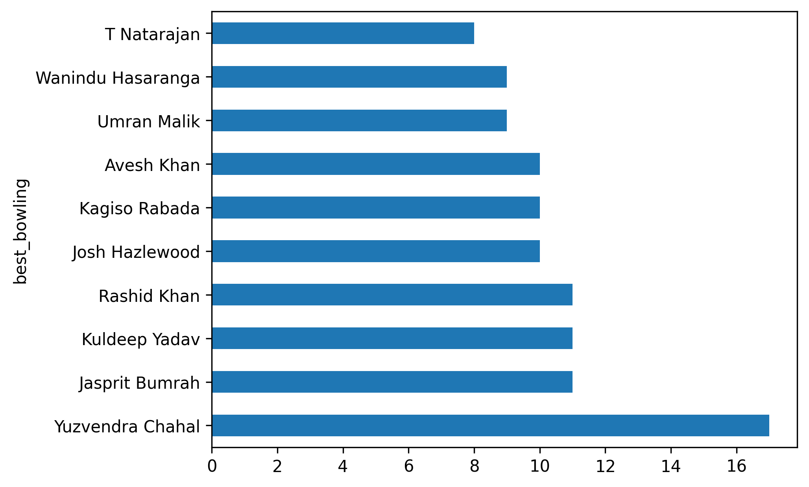
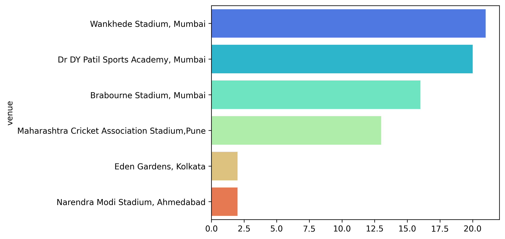

# IPL 2022 Match Analysis 🏏

## Project Overview
This project analyses IPL 2022 match-level data to uncover insights about team performance, toss impact, player achievements, venue trends, and match outcomes using Python.

## Dataset Information
- Matches: 74
- Columns: 20
- Source: IPL 2022 Match Dataset

## Technologies Used
- Python
- Pandas
- NumPy
- Matplotlib
- Seaborn
- Plotly

## Project Workflow
1. Data Loading
2. Data Cleaning
3. Exploratory Data Analysis
4. Visualisation
5. Insights Generation

## Questions Solved

### Team Performance
- Which team won the most matches?

### Toss Analysis
- Toss Decision Trends
- Does winning the toss impact match results?

### Match Insights
- Runs vs Wickets wins

### Player Performance
- Most Player of the Match awards
- Top scorers
- Best bowling performances

### Venue Analysis
- Most matches played by venue

### Custom Insights
- Highest margin victory
- Highest individual score
- Best bowling figures

---

# Dashboard / Visualisations

### Team Wins


---

### Toss Decision Trends


---

### Winning Margin Types


---

### Player of Match


---

### Additional Visuals






---

## Key Findings
- Gujarat won the most matches.
- Toss winner converted into match wins around 48.65%.
- Jos Buttler emerged as one of the top scorers.
- Multiple bowlers achieved 5-wicket performances.

## Run Locally

```bash
pip install -r requirements.txt
jupyter notebook
```

## Author
Sourav Mukherjee
